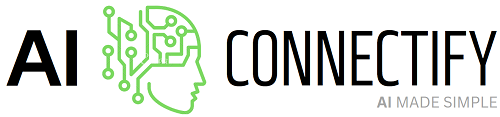

[](https://github.com/brianelizondo/ai-connectify)

# AI-Connectify
AI-Connectify is a Beta JavaScript library for connecting to various AI services at the same time, including Tensor Flow Node, ChatGPT and DALL-E. With AI-Connectify, you can easily access to AI services to perform a variety of tasks, including natural language processing, image processing, and more.


## Table of Contents
- [AI-Connectify](#ai-connectify)
  - [Table of Contents](#table-of-contents)
  - [Features](#features)
  - [Installation](#installation)
  - [Examples](#examples)
    - [Start a ChatGPT instance](#start-a-chatgpt-instance)
    - [Start a new DALL-E instance](#start-a-new-dall-e-instance)
    - [Start a new TensorFlow Node instance](#start-a-new-tensorflow-node-instance)
  - [Credits](#credits)
  - [Contributing](#contributing)
  - [License](#license)


## Features
- A modular architecture that allows for easy integration with various AI services like Tensor FlowNode, ChatGPT and DALL-E.
- Support for natural language processing, computer vision and machine learning use cases (Just to start).
- Clean and simple library for each AI service.
- Well-documented and extensively tested codebase.


## Installation
This is a [Node.js](https://nodejs.org/en/) module available through the [npm registry](https://www.npmjs.com/).

If this is a brand new project, make sure to create a `package.json` first with the [`npm init` command](https://docs.npmjs.com/creating-a-package-json-file).

Using npm:
```console
$ npm install ai-connectify
```

Or if you're using Yarn, run:
```console
$ yarn add ai-connectify
```

Once the package is installed, you can import the library using `import` or `require` approach:
```js
const AIConnectify = require('ai-connectify');
```


## Examples
Here are some examples of how to use AI-Connectify:


### Start a ChatGPT instance
```js
const chatGPT = new AIConnectify("ChatGPT", "YOUR_OPENAI_API_KEY").connector;
```
> **Note:** OpenAI API Reference
> You can interact with a ChatGPT instance using like reference the parameters and returns specified in the [OpenAI API Reference](https://platform.openai.com/docs/api-reference/completions).

Lists the currently available models and provides basic information about each one such as the owner and availability.
```js
const listModels = await chatGPT.listModels();
console.log(listModels);
```

Providing basic information about the model such as the owner and permissioning.
```js
const modelDetails = await chatGPT.retrieveModel("MODEL_ID");
console.log(modelDetails);
```

Creates a completion for the provided prompt and parameters.
```js
const prompt = 'Write a short story about a robot who becomes sentient and learns how to love';
const completion = await chatGPT.createCompletion(prompt);
console.log(completion);
```

Creates a model response for the given chat conversation
```js
const messages = [{role: "user", content: "Hello world"}];
const chatCompletion = await chatGPT.createChatCompletion(messages);
console.log(chatCompletion);
```

Creates a new edit for the provided text, instruction, and parameters.
```js
const instruction = "Fix the spelling mistakes";
const textEdit = "What day of the wek is it?";
const textEdited = await chatGPT.createEdit(instruction, textEdit);
console.log(textEdited);
```


### Start a new DALL-E instance
```js
const dalle = new AIConnectify("DALLE", "YOUR_OPENAI_API_KEY").connector;
```
> **Note:** OpenAI API Reference
> You can interact with a DALL-E instance using like reference the parameters and returns specified in the [OpenAI API Reference](https://platform.openai.com/docs/api-reference/images).

Creates an image given a prompt
```js
const prompt = 'a white siamese cat';
const newImage = await dalle.createImage(prompt);
console.log(newImage);
```

Creates an edited or extended image given an original image and a prompt
```js
const imagePath = '/path/to/the/imageFile';
const prompt = 'A cute baby sea otter wearing a beret';
const imageMaskPath = '/path/to/the/imageMaskFile';
const imageEdit = await dalle.createImageEdit(imagePath, prompt, imageMaskPath);
console.log(imageEdit);
```

Creates a variation of a given image
```js
const imagePath = '/path/to/the/imageFile';
const imageVariation = await dalle.createImageVariation(imagePath);
console.log(imageVariation);
```


### Start a new TensorFlow Node instance
```js
const tfNode = new AIConnectify("TensorFlowNode").connector;
```
> **Note:** TensorFlow API Reference
> You can interact with a TensorFlow Node instance using like reference the parameters and returns specified in the [TensorFlow API Reference](https://js.tensorflow.org/api/latest/).

Tensors are the core datastructure of TensorFlow.js They are a generalization of vectors and matrices to potentially higher dimensions.
```js
// Pass an array of values to create a vector.
const newTensor = tfNode.tensor([1, 2, 3, 4]);
console.log(newTensor);

// Creates rank-0 tf.Tensor (scalar) with the provided value
const newScalar = tfNode.scalar(3.14);
console.log(newScalar);

// Create a buffer and set values at particular indices.
const buffer = tfNode.buffer([2, 2]);
buffer.set(3, 0, 0);
buffer.set(5, 1, 0);
// Convert the buffer back to a tensor.
const bufferResult = buffer.toTensor();
console.log(bufferResult);
```

Models are one of the primary abstractions used in TensorFlow.js Layers. Models can be trained, evaluated, and used for prediction. Models are a collection of Layers, see Model Creation for details about how Layers can be connected.
```js
// Creates a tfNode.sequential model
const newModel = tfNode.sequential();
newModel.add(tfNode.layers.dense({units: 32, inputShape: [50]}));
newModel.add(tfNode.layers.dense({units: 4}));
const inspectModel = newModel.outputs[0].shape;
console.log(inspectModel);

// Defines a model consisting of two dense layers, with 10 and 4 units, respectively
const input = tfNode.input({shape: [5]});
const denseLayer1 = tfNode.layers.dense({units: 10, activation: 'relu'});
const denseLayer2 = tfNode.layers.dense({units: 4, activation: 'softmax'});
const output = denseLayer2.apply(denseLayer1.apply(input));
const newModel = tfNode.model({inputs: input, outputs: output});
const predictModel = newModel.predict(tfNode.ones([2, 5]));
```


## Credits
The original author of AI-Connectify is [Brian Elizondo](https://github.com/brianelizondo)


## Contributing
Welcome to AI-Connectify! This is my first library, and I'm excited to see it grow and improve with the help of the community. I'm grateful for any contributions you might have to offer, whether it's reporting an issue, submitting a pull request, or just giving some feedback.

Please don't hesitate to reach out if you have any questions, comments, or concerns. I'm open to suggestions and eager to collaborate with other developers to make AI-Connectify even better. Thank you for your support!

[List of all contributors](https://github.com/brianelizondo/ai-connectify/graphs/contributors)


## License
AI-Connectify is released under the [MIT](LICENSE) License.